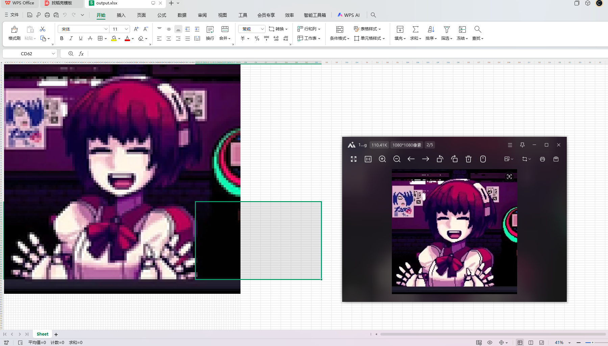

没啥好说的，将图片转换为Excel像素画的Python工具
因为在bilibili刷到大佬画图所以写了个代码

## 功能特性

- 🎨 精确颜色转换（RGB → Excel颜色填充）
- 📐 智能尺寸缩放（保持长宽比）
- ⚡ 优化处理性能（进度提示）
- 🖼️ 支持多种图片格式（JPG/PNG/BMP等）
- 📊 自动设置单元格格式（统一尺寸）

## 安装

### 依赖环境
- Python 3.7+
- Pillow 9.0+
- openpyxl 3.0+

玩的愉快
